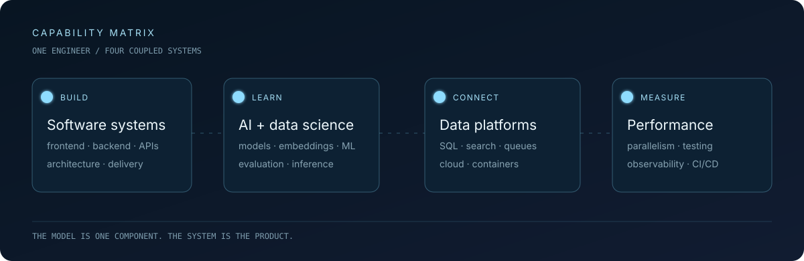
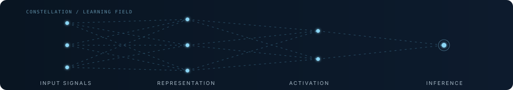
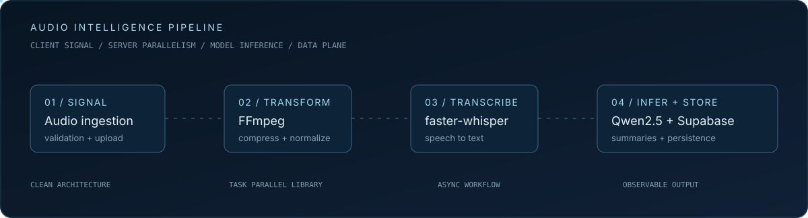
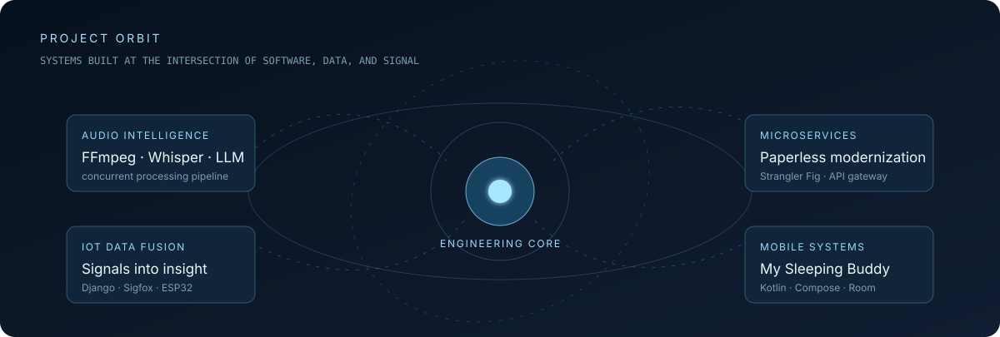
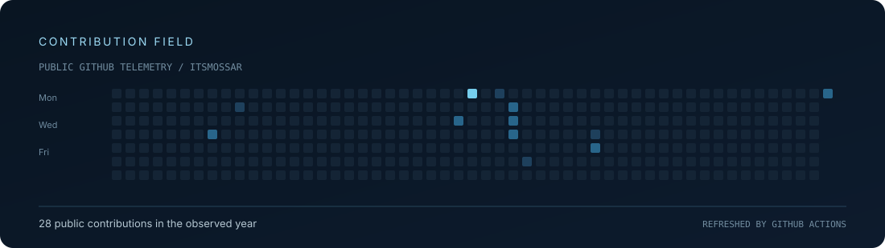

<p align="center">
  
</p>

<p align="center">
  
</p>

<p align="center"><sub>FULL-STACK ENGINEER &nbsp;|&nbsp; AI ENGINEER &nbsp;|&nbsp; DATA SCIENTIST &nbsp;|&nbsp; SYSTEMS THINKER</sub></p>

> I engineer the path from raw signal to useful decision: interfaces that people trust, backends that scale, and intelligent systems that can explain what they did with the data.

## [ 01 ] Identity / the observer effect

I am **Gabriel Mendoza Escobar** - a Full-Stack Engineer working across frontend, backend, data, cloud, architecture, quality, and technical leadership. I also work as an **AI Engineer and Data Scientist**, applying machine learning, deep learning, data processing, and model-driven product thinking to real software systems.

My next specialization is AI engineering: designing the infrastructure around models as carefully as the models themselves - data quality, evaluation, inference, observability, performance, and the human workflow on the other side of the output.

`observation -> model -> system -> measurable impact`

<p align="center">
  
</p>

## [ 02 ] Engineering matrix

I do not separate software engineering from AI or data work. A model needs reliable inputs, an API, storage, monitoring, and a product experience before it becomes useful.

<p align="center">
  
</p>

**Application systems**

`TypeScript` `JavaScript` `C#` `Python` `Kotlin` `SQL` `Angular` `React` `Next.js` `ASP.NET Core` `Node.js` `Express` `FastAPI` `Django`

**AI / data science**

`PyTorch` `TensorFlow` `scikit-learn` `NumPy` `Pandas` `Jupyter` `Hugging Face` `Transformers.js` `faster-whisper` `Qwen2.5`

**Data, architecture, and delivery**

`PostgreSQL` `SQL Server` `MongoDB` `Redis` `Elasticsearch` `Supabase` `Docker` `Kubernetes` `Azure` `GitHub Actions` `GitLab CI/CD` `Linux`

**Performance and systems work**

`FFmpeg` `NAudio` `NBomber` `Task Parallel Library` `RxJS` `Web Workers` `OpenAPI` `Prometheus` `Grafana`

<p align="center">
  
</p>

## [ 03 ] AI / data flight path

My AI work is grounded in the full lifecycle: acquire the signal, clean and represent the data, run the model, evaluate the result, and ship a system that remains observable under real load.

<p align="center">
  
</p>

The **Audio Processor Pipeline** is the clearest expression of that approach: a .NET 8 API and Angular 19 client coordinate concurrent compression with FFmpeg, speech-to-text with faster-whisper, AI summarization with Qwen2.5, and cloud storage through Supabase. The system uses parallel processing, client-side audio validation, reactive uploads, load testing, and Clean Architecture rather than treating the model as an isolated feature.

```text
raw data -> transform -> learn / infer -> evaluate -> serve -> observe
```

## [ 04 ] Systems in orbit

<p align="center">
  
</p>

- **Audio Processor Pipeline** - Full-stack, concurrent client-server architecture for journalism audio; FFmpeg, faster-whisper, Qwen2.5, .NET 8, Angular 19, Supabase, NBomber, and parallel DSP.
- **Paperless-ngx Microservices Modernization** - A Strangler Fig migration that isolates OCR and search capabilities through independent services, intelligent routing, anti-corruption layers, and an API gateway.
- **PixPro** - AI-assisted image processing with real-time status updates, secure media delivery, distributed service concerns, and scalable workflows.
- **IoT DataFusion Suite** - Public work connecting a Django API, Sigfox device data, visualization, and an ESP32 simulation: [explore the repository](https://github.com/itsmossar/IoT-DataFusionSuite-W6-GM).
- **My Sleeping Buddy** - Kotlin and Jetpack Compose mobile development with Room, Coroutines, StateFlow, Hilt, Hexagonal Architecture, and CI quality gates.

## [ 05 ] How I build

`architecture before accidental complexity`  
`measurement before confidence`  
`performance as a product feature`  
`data contracts before model claims`  
`automation before repetition`

I have led technical teams and Scrum delivery, worked with Clean Architecture, microservices, API-first design, automated testing, CI/CD, and cloud deployment. I care about the boundary conditions: latency, failure modes, observability, reproducibility, and whether the next person can safely change the system.

## [ 06 ] Research orbit

Physics and astronomy shape the questions I bring to engineering: how does information move, what does a measurement hide, and where does signal end and noise begin?

`Delta x * Delta p >= h / 2`  
`|psi> = alpha|0> + beta|1>`

Quantum computing, information theory, and machine learning are connected here by a single interest: systems whose behavior is richer than the first simple description of them.

## [ 07 ] Live signal

<p align="center">
  
</p>

GitHub's native profile calendar remains the source of truth for contribution activity. This visual stays intentionally self-contained: no third-party statistic widget, no background bot commits, and no invented metrics.

<p align="center">
  
</p>

<p align="center">
  <a href="mailto:gabriel.mendoza@jala.university">gabriel.mendoza@jala.university</a>
  &nbsp;&nbsp;|&nbsp;&nbsp;
  <a href="https://github.com/itsmossar">github.com/itsmossar</a>
</p>

<p align="center"><sub>END OF TRANSMISSION // KEEP ASKING BETTER QUESTIONS</sub></p>
